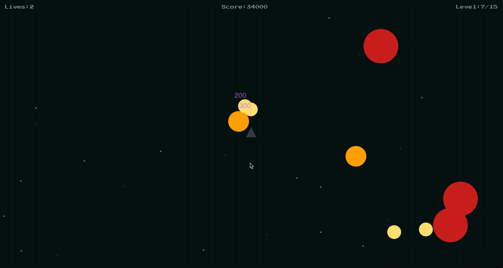

# Asteroids JS
A minimal and modern vanilla javascript version on the Asteroids game.

## 🚀 Why?

Growing up "Asteroids" and "Blasteroids" were some of my favourite games.

I have spent hours and hours playing them on my Spectrum 128K computer, and I was always thought it was really cool how such simple games could be so much fun to play.

## 🎮 How to play
- [Play it here](https://boguz.github.io/asteroids/)
- Use `A`, `W` and `D` to move and `SPACE` to shoot.

## 🏆 Community
If you get a cool hi-score post it on instagram or twitter using the hashtag `#asteroidsjs`.
